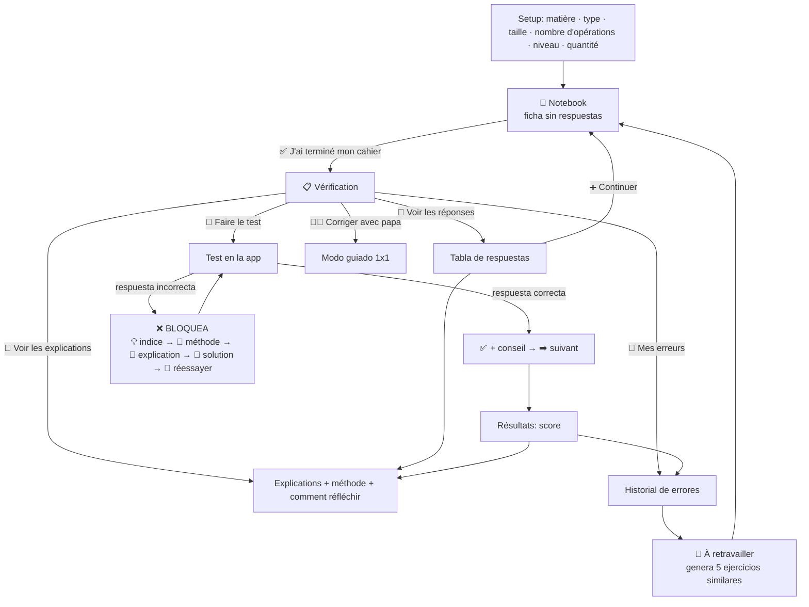
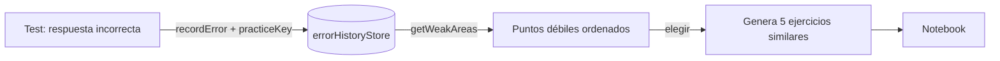

# 📚 Ejercicios de Lena — Catálogo y Workflow

Documento de referencia de **todos los ejercicios** de la app, su estructura de
datos, el flujo pedagógico ("professeur patient") y cómo **añadir o extender**
contenido sin tocar la lógica.

> Idiomas de la interfaz: **fr · nl · en · es**. El cálculo aritmético es
> simbólico (universal); los enunciados de texto se localizan; el contenido de
> aprendizaje de francés (français/dictée) permanece en francés a propósito.

---

## 1. Mapa general

| Módulo | Ruta | Tipo de contenido | Estado i18n |
|---|---|---|---|
| **Mon cahier** (generadores) | `/cahier` | Ejercicios generados en vivo | UI + mate ✅ · français FR |
| Atelier **Figures géométriques** | `/cahier/geometrie` | SVG generado | UI FR |
| Atelier **Défis de calcul** | `/cahier/defis-calcul` | Generado paso a paso | UI FR |
| Atelier **Calculs à composer** | `/cahier/calculs-melanges` | Configurable | UI FR |
| Atelier **À retravailler** | `/cahier` → 💪 | Adaptativo (errores) | UI 4 idiomas |
| **Bibliothèque d'examens** | `/exam/library` | JSON estático (130) | FR (lote futuro) |
| **Lecture & compréhension** | `/exam/lecture` | Historias JS | FR (lote futuro) |

Archivos clave:

```
src/features/exerciseGenerator/   → Mon cahier (motor + UI + i18n)
src/features/mathGeometry/        → atelier geometría (SVG)
src/features/mathChallenges/      → défis + calculs à composer
src/content/exams/<cat>/*.json    → 130 exámenes (auto-registrados)
src/content/lecture/stories.js    → 10 historias de lectura
src/services/storage/errorHistoryStore.js → errores globales + à retravailler
```

---

## 2. Workflow pedagógico (Mon cahier)

> Regla de oro: **la niña trabaja sola primero**; las respuestas y explicaciones
> solo aparecen **después** de terminar su cuaderno. En el test, una respuesta
> **incorrecta NO avanza**.



### Ciclo de aprendizaje
1. **Je cherche seul** — genera la ficha, resuelve en papel.
2. **Je vérifie** — ve respuestas o hace el test.
3. **Je comprends** — explicaciones con método y "comment réfléchir".
4. **Je corrige mes erreurs** — sección Mes erreurs.
5. **Je m'améliore** — À retravailler regenera ejercicios del punto débil.

---

## 3. Mon cahier — materias, tipos y opciones

### Opciones independientes (math additions/soustractions)
- **Taille des nombres**: Auto · 1 · 2 · 3 · 4 chiffres
- **Nombre d'opérations**: Auto · 2 · 3 · 4 · 5 nombres
- Combinables: `2+2` (1 chiffre, 2 nombres) … `347+125+52+60` (3 chiffres, 4 nombres)
- **Auto** = progresión por nivel (facile=2, moyen=3, difficile=4 operandos).

### Catálogo (`exerciseTypes.js`)

| Materia | Tipos |
|---|---|
| 🔢 Mathématiques | Additions · Soustractions · Multiplications · Divisions simples · Mesures (cm/kg/€) · Problèmes écrits |
| 📝 Français | Compléter la phrase · Choisir le bon mot · Compréhension courte · Vocabulaire · Grammaire simple |
| 🎧 Dictée | Mots simples · Petites phrases |

Niveles: **Facile · Moyen · Difficile**. Cantidad: **5 · 10 · 15**.

### Ateliers especiales
- **📐 Les figures géométriques** — 4 tipos con SVG real: contar figuras, tableau des propriétés, compléter sur quadrillage, colorier (interactivo).
- **🧮 Défis de calcul** — calculs en chaîne, soustractions difficiles, **avec retenue** (explicada paso a paso), calcul mental malin.
- **🧩 Calculs à composer** — configurable: operaciones (+ − × ÷), nº de números (2–4), tamaño (1–3), con división **exacta** y presets (🟢/🟠/🔴).

---

## 4. Estructura estándar de un ejercicio generado

```js
{
  id, subject, type, level,
  question,          // mostrado en el CUADERNO (lo que resuelve a mano)
  testQuestion,      // mostrado en el TEST (localizado)
  answer,            // respuesta correcta (string)
  acceptedAnswers,   // equivalentes (ej. "20", "20 mm")
  explanation,       // corrección
  method,            // método paso a paso ("75 + 10 = 85\n85 + 6 = 91")
  improvementTip,    // consejo para progresar
  hints: [h1, h2, h3], // ayuda PROGRESIVA (no revela la respuesta)
  inputType,         // 'number' | 'text' | 'choice' | 'color'
  options,           // para 'choice'
  visual,            // SVG opcional: puntos (suma) o matriz (multiplicación)
}
```

- **Validación flexible** (`checkAnswer`): trim, minúsculas, sin acentos, `"20"=="20mm"=="20 mm"`.
- **Teclado numérico** automático si la respuesta es solo número.
- **Sin duplicados** en una misma ficha (el motor regenera colisiones).

---

## 5. Bibliothèque d'examens — 130 exámenes JSON

13 categorías × 10 exámenes × 3 niveles (facile/moyen/difficile) con respuestas
y correcciones. **Auto-registrados** por `import.meta.glob` → añadir = soltar un
JSON, sin tocar código.

| Categoría | Carpeta | Nº |
|---|---|---|
| Compréhension lecture | `comprehension-lecture/` | 10 |
| Calcul mental | `calcul-mental/` | 10 |
| Problèmes mathématiques | `problemes-mathematiques/` | 10 |
| Calendrier & temps | `calendrier-temps/` | 10 |
| Vocabulaire | `vocabulaire/` | 10 |
| Orthographe | `orthographe/` | 10 |
| Dictée | `dictee/` | 10 |
| Grammaire | `grammaire/` | 10 |
| Conjugaison | `conjugaison/` | 10 |
| Logique | `logique/` | 10 |
| Géométrie | `geometrie/` | 10 |
| Mesures | `mesures/` | 10 |
| Découverte du monde | `decouverte-monde/` | 10 |

Esquema (`src/content/exams/schema.js`): tipos `mcq`, `true_false`,
`fill_blank`, `association`; cada nivel con `passPercent` + `questions[]`
(con `correction`). Generador reproducible: `npm run gen:exams`.

---

## 6. Lecture & compréhension — 10 historias

`src/content/lecture/stories.js` (y generadas en `scripts/data/lecture-data.mjs`).
Cada historia: páginas narrativas + banco de preguntas etiquetado (easy/medium/
hard) → 3 niveles. Temas: anniversaire, école, parc, bibliothèque, animaux,
famille, vacances, amitié, nature, sport.

---

## 7. Sistema adaptativo "À retravailler"



- Cada error guarda `practiceKey` (`subject:type`) + nivel.
- `getWeakAreas()` agrupa y ordena por nº de fallos.
- Al elegir un punto débil → **5 ejercicios similares** en el flujo normal.

---

## 8. i18n — cómo funciona

- `cahierI18n.js`: diccionario de UI, etiquetas y "comment réfléchir" en
  **fr/nl/en/es**, vía `useCahierT()` (ligado al locale activo `useLocale()`).
- Generadores: `setGenLocale(locale)` localiza enunciados de mate y problèmes.
- Aritmética = simbólica (universal). Français/dictée = francés (por diseño).

---

## 9. Workflow para AÑADIR ejercicios

### A. Nuevo tipo de ejercicio generado (Mon cahier)
1. `exerciseTypes.js` → añade `{ id, label, emoji }` en la materia.
2. `exerciseTemplates.js` → escribe el generador y regístralo en `GENERATORS['subject:type']`.
   - Devuelve la **estructura estándar** (§4): incluye `hints[3]`, `method`, `improvementTip`.
3. (Opcional) localiza enunciados con `_locale` / mapas por idioma.
4. Test: `tests/exercise-engine.test.js` valida hints + auto-corrección.
> No hay que tocar la UI: el runner es genérico.

### B. Nuevo examen estático (Bibliothèque)
1. Crea `src/content/exams/<categoria>/<id>.json` siguiendo `schema.js`
   (3 niveles, preguntas con `correction`).
2. Listo: se auto-registra. Valida con `node --test tests/exam-library.test.js`.
   - O genera por lote editando `scripts/data/exam-builders.mjs` + `npm run gen:exams`.

### C. Nueva historia de lectura
1. Añade una entrada en `scripts/data/lecture-data.mjs` (páginas + questionPool etiquetado).
2. `npm run gen:exams` regenera la categoría.

### Checklist de calidad
- [ ] `hints` no revelan la respuesta (progresivos).
- [ ] `method` muestra el razonamiento paso a paso.
- [ ] Respuesta auto-verificable (`checkAnswer(ex, ex.answer)` = true).
- [ ] `inputType` correcto (number → teclado numérico).
- [ ] Sin duplicados en la ficha.
- [ ] Mensajes siempre positivos (jamás "Faux → suivant").

---

## 10. Comandos

```bash
npm run dev          # desarrollo
npm run gen:exams    # regenerar los 130 exámenes + historias
npm run build        # build (base '/')
npm run build:gh     # build GitHub Pages (base '/Lena/')
node --test tests/exercise-engine.test.js   # tests del motor del cahier
node --test tests/exam-library.test.js      # valida los 130 JSON
```
